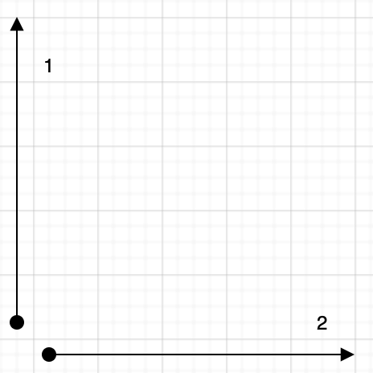
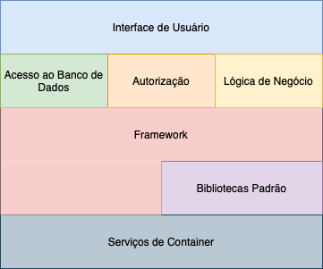

# Introdução

Existem algumas ideias e dicas que se aplicam a todos os níveis do desenvolvimento de software, processos dados como universais, e idéias quase que axiomáticas. Entretanto, essas ideias raramente são escritas e discutidas, normalmente nos deparamos com elas em frases estranhas em alguma discussão sobre arquitetura de software. Vamos discutir aqui algumas dessas ideias e tentar documentá-las ao longo do caminho.

O primeiro e talvez mais importante tópico vai direto ao coração do desenvolvimento: *A Essência do Bom Design*. Todo o restante vêm disso.

Logo após vamos discutir sobre *DRY - Os Males da Duplicação* e *Ortogonalidade*. Esses dois tópicos são intimamente relacionados. O primeiro fala para você não duplicar conhecimento pelo seus sistema, o segundo para não dividir nenhum conhecimento em vários componentes do sistema.

# A Essência do Bom Design

Vamos começar tentando concordar em algo:
> Um bom design é mais fácil de mudar do que um design ruim

Algo com um bom design se adapta à pessoa que o usa. No código isso significa que ele deve se adaptar quando algo à sua volta muda.

## Princípio *ETC - Easier To Change*

Todo princípio de design pode ser visto como um caso especial de ETC.

- Por que desacoplamento é bom? Porque isolando responsabilidades tornamos cada uma mais fácil de mudar. ETC.
- Por que o *Single Responsibility Pattern* é bom? Porque a mudança de um requisito afeta somente um módulo. ETC.
- Por que nomear é importante? Porque bons nomes deixam o código mais fácil de ler, e você tem que ler para mudar. ETC.

## ETC é um valor, não uma regra

Valores te ajudam a tomar decisões: eu devo fazer isso ou aquilo? Quando se trata pensar sobre software, ETC é um guia, te ajudando a fazer escolhas entre caminhos. Assim como outros valores, ele deve ser quase que inconsciente, sutilmente levando você na direção correta.

Para tornar isso um hábito, você deve primeiro tomar ações conscientes, se pergunte "a mudança que eu recém fiz torna o sistema mais fácil de mudar?". Pergunte-se depois de salvar um arquivo. Pergunte-se depois de escrever um teste. Pergunte-se depois de resolver um bug.

O ETC assume que você sabe dizer qual dos caminhos vai ser o mais fácil de mudar no futuro. Na maioria das vezes o senso comum vai estar certo ou você pode dar palpites. Algumas vezes você não vai ter a menor ideia, nesses casos você pode fazer duas coisas:

1. Se não souber que forma vai tomar, você sempre pode voltar pro caminho "fácil de mudar": tente escrever código substituível. Desta maneira, independente do que acontecer no futuro, esse código não vai te atrapalhar.

2. Aproveite para desenvolver seus instintos. Anote a situação: as escolhas que você teve e alguns palpites sobre a mudança. Mais tarde, quando o código teve que ser alterado, você vai poder olhar para trás e se dar um feedback. Isso pode te ajudar na próxima vez que você encontrar uma situação parecida.

# DRY - Os males da duplicação

Como programadores nós coletamos, organizamos, mantemos e aproveitamos conhecimento. Nós documentamos conhecimento em especificações, damos vida à ele quando executamos código, e usamos ele para fornecer as verificações necessárias durante os testes.

Infelizmente, conhecimento não é estável. Ele muda —frequentemente muito rápido. Seu entendimento  de um requisito pode trocar após uma reunião com o cliente. O governo muda uma regulação e alguma lógica de negócio pode ficar desatualizada. Testes mostram que o algoritmo escolhido não vai funcionar. Toda essa instabilidade significa que nós gastamos a maior parte do nosso tempo no **modo de manutenção**, reorganizando e re-expressando o conhecimento em nossos sistemas.

A maioria das pessoas assume que a manutenção começa quando a aplicação é lançada, que manutenção significa corrigir bugs e features de melhoria. Nós achamos que essas pessoas estão erradas. Programadores estão sempre em **modo de manutenção**. Nosso entendimento muda dia-a-dia. Novos requisitos chegam e requisitos existentes evoluem enquanto desenvolvemos o projeto. Talvez o ambiente mude. Seja qual for o motivo, manutenção não é uma atividade discreta, mas uma rotina que faz parte integral do processo de desenvolvimento.

Quando realizamos manutenção, temos que procurar e trocar a representação das coisas —as cápsulas de conhecimento embutidas na aplicação. O problema é que é fácil duplicar conhecimento nas especificações, processos, e programas que desenvolvemos, e quando fazemos isso, estamos arrumando um pesadelo de manutenção —um que começa antes mesmo de lançarmos a aplicação.

Sentimos que a única maneira de desenvolver aplicações confiáveis, e fazer nossos desenvolvimentos mais fáceis de entender e de manter, é seguir o que chamamos de princípio *DRY*.

*Todo conhecimento deve ter uma representação única, não ambígua e autoritária dentro de um sistema*

Por que chamamos de *DRY*?

> DRY - Don't Repeat Yourself

A alternativa seria expressar a mesma coisa em dois ou mais lugares. Se você trocar em um lugar, tem que se lembrar de trocar nos outros, senão seu programa vem ao chão. A questão não é **se** você vai lembrar, mas **quando** você vai esquecer.

## DRY é mais que código

Muitas pessoas acham que isso se refere estritamente ao código, acham que DRY significa "não copiar e colar código".

Isto é parte do DRY, mas apenas uma porção pequena e trivial dele.

DRY é sobre duplicação de **conhecimento**, de **intenção**. É sobre expressar a mesma coisa em lugares diferentes, possivelmente de forma totalmente distinta.

Aqui está o teste definitivo: quando alguma parte do código tem que ser alterada, você se encontra fazendo a mesma mudança em vários lugares, e de formas diferentes? Você tem que mudar o código e documentação, ou o schema do banco e sua estrutura, or ...? Se sim, seu código não está DRY.

Vamos ver alguns exemplos de duplicação

## Duplicação em código

```ruby
def print_balance(account)
  printf "Debits:  %10.2f\n", account.debits
  printf "Credits: %10.2f\n", account.credits
  if account.fees < 0
    printf "Fees:    %10.2f-\n", -account.fees
  else
    printf "Fees:    %10.2f\n", account.fees
  end
  printf "              -----\n"
  if account.balance < 0
    printf "Balance: %10.2f-\n", -account.balance
  else
    printf "Balance: %10.2f\n", account.balance
  end
end
```

Primeiramente, claramente existe uma duplicação copia-e-cola para lidar com os números negativos. Podemos arrumar isso adicionando outra função:

```ruby
def format_amount(value)
  result = sprintf("%10.2f", value.abs)
  if value < 0
    result += '-'
  else
    result + ' '
  end
end

def print_balance(account)
  printf "Debits:  %10.2f\n", account.debits
  printf "Credits: %10.2f\n", account.credits
  printf "Fees:    %s\n", format_amount(account.fees)
  printf "              -----\n"
  printf "Balance: %s\n", format_amount(account.balance)
end
```

Outra duplicação é a repetição da largura do campo em todas as chamadas ao `printf`. Podemos arrumar isso introduzindo uma constante e passando ela para cada chamada, mas por que não utilizar a função que acabamos de criar?!

```ruby
def format_amount(value)
  result = sprintf("%10.2f", value.abs)
  if value < 0
    result += '-'
  else
    result + ' '
  end
end

def print_balance(account)
  printf "Debits:  %s\n", format_amount(account.debits)
  printf "Credits: %s\n", format_amount(account.credits)
  printf "Fees:    %s\n", format_amount(account.fees)
  printf "              -----\n"
  printf "Balance: %s\n", format_amount(account.balance)
end
```

Algo mais? Bem, se o cliente pedir um espaço extra entre os rótulos e os números? Teríamos que trocar cinco linhas. Vamos remover essa duplicação:

```ruby
def format_amount(value)
  result = sprintf("%10.2f", value.abs)
  if value < 0
    result += '-'
  else
    result + ' '
  end
end

def print_line(label, value)
  printf "%-9s%s\n", label, value
end

def report_line(label, amount)
  print_line(label + ':', format_amount(amount))
end

def print_balance(account)
  report_line('Debits', account.debits)
  report_line('Credits', account.credits)
  report_line('Fees', account.fees)
  print_line('', '     -----')
  report_line('Balance', account.balance)
end
```

Se tivermos que mudar a formatação dos montantes, mudamos `format_amount`. Se quisermos mudar o formato do rótulo, mudamos `report_line`.

Ainda existe uma violação implícita do DRY: o número de hífens do separador é relacionado a largura do montante. Mas não é uma correspondência exata: atualmente é um caractere mais curto, estão quaisquer sinais à direita vão além da coluna. Esta é a intenção do cliente, e é diferente da intenção da formatação do montante.

## Nem toda duplicação de código é duplicação de conhecimento

Como parte de um sistema de encomenda de vinho você está capturando e validando a idade de deus seus usuários, junto com a quantidade do pedido. De acordo com o dono do site, ambos devem ser números, e ambos maiores que zero. Então você escreve  validações assim:

```python
def validate_age(value):
  validate_type(value, :integer)
  validate_min_integer(value, 0)

def validate_quantity(value):
  validate_type(value, :integer)
  validate_min_integer(value, 0)
```

Durante o Code Review alguém rejeita o código e alega que está violando o DRY: ambos os corpos das funções têm o mesmo código.

Ele está errado. O código é o mesmo, mas o **conhecimento** que ele representa é diferente. As duas funções validam coisas separadas que por acaso têm as mesmas regras. Isso é um coincidência, não duplicação.

## Duplicação na documentação

De alguma maneira surgiu o mito de que você deve comentar todas as suas funções. Aqueles que acreditam nesta insanidade escrevem algo assim:

```ruby
# Calcula taxas da conta
#
# * Cada cheque retornado custa R$20,00
# * Se a conta estiver com cheque especial por mais de 3 dias,
#   cobra R$10,00 para cada dia
# * Se o saldo médio da conta for maior que R$2.000,00
#   reduz as taxas para 50%
def fees(a)
  f = 0
  if a.returned_check_count > 0
    f += 20 * a.returned_check_count
  end
  if a.overdraft_days > 3
    f += 10*a.overdraft_days
  end
  if a.average_balance > 2_000
    f /= 2
  end
  f
end
```

A intenção deste código foi dada duas vezes: a primeira vez no comentário e de novo no código. O cliente troca a taxa, e temos que atualizar os dois. Com o tempo, podemos garantir que o comentário e o código vão discordar.

Pergunte a si mesmo, o que o comentário agrega ao código. Do nosso ponto de vista ele apenas compensa maus nomes e má disposição. Que tal reescrevermos ele assim:

```ruby
def calculate_account_fees(account)
  fees  = 20 * account.returned_check_count
  fees += 10 * account.overdraft_days if account.overdraft_days > 3
  fees /= 2                           if account.average_balance > 2_0000
  fees
end
```

O nome diz o que ele faz, se alguém precisar de mais detalhes, eles estão dispostos no código. Isso é DRY!

## Violações do DRY nos dados

Nossas estruturas de dados representam conhecimento, e elas também podem violar o princípio DRY. Vamos ver uma classe que representa uma linha:

```java
class Line {
  Point start;
  Point end;
  double length;
};
```

Logo de cara a classe parece razoável. Uma linha tem um início e um fim, e sempre vai ter um fim (mesmo que zero). Mas temos uma duplicação. O comprimento é definido pelos pontos `start` e `end`: mude um dos pontos e o comprimento muda. É melhor fazer o comprimento um campo calculado.

```java
class Line {
  Point start;
  Point end;
  double lenght() { return start.distanceTo(end); }
};
```

Mais tarde, durante o processo de desenvolvimento, você pode decidir violar o princípio DRY por motivos de performance. Frequentemente isso ocorre porque você precisa fazer o cache dos dados para evitar operações custosas. A jogada é limitar o impacto, não deixar a violação ficar exposta ao mundo externo, apenas métodos da classe devem se preocupar em manter as coisas em ordem:

```java
class Line {
  private double length;
  private Point start;
  private Point end;

  public Line(Point start, Point end) {
    this.start = start;
    this.end = end;
    calculateLength();
  }

  Point getStart() { return start; }
  void setStart(Point p) { this.start = p; calculateLength(); }

  Point getEnd() { return end; }
  void setEnd(Point p) { this.end = p; calculateLength(); }

  double getLength() { return length; }

  private void calculateLength() {
    this.length = start.distanceTo(end);
  }
};
```

Esse exemplo também ilustra uma questão importante: sempre que um método expõe uma estrutura de dados, você acopla todo o código que usa essa estrutura à implementação desse módulo. Quando possível, sempre utilize métodos para ler e escrever atributos do objeto. Isso vai tornar mais fácil adicionar funcionalidades no futuro.

O uso de funções de acesso se vincula ao *Princípio de Acesso Uniforme de Meyer*, descrito em *Object-Oriented Software Construction*, que afirma que:

> Todos os serviços de um módulo devem estar disponíveis através de uma única notação, que não entrega se eles são implementados por armazenamento ou computação

## Duplicação de Representação

O seu código conversa com o mundo externo: outras bibliotecas via APIs, outros services via chamadas remotas, dados em recursos externos, e por aí vai. E praticamente toda vez que você faz isso, você introduz algum tipo de violação do DRY: seu código tem que ter o conhecimento que está presente nesta *coisa* externa. Ele precisa saber a API, ou o Schema, ou o sentido dos códigos de erro, ou o que for. A duplicação aqui é que duas coisas (seu código e a entidade externa) têm que ter conhecimento da representação de suas interfaces. Troque em um lugar, e o outro quebra.

Esta duplicação é inevitável, mas pode ser mitigada. Aqui estão algumas estratégias.

### Duplicação Entre APIs Internas

Para APIs internas, procure ferramentas que permitam a especificação da API em algum formato neutro. Essas ferramentas geralmente geram documentação, testes funcionais, e clientes de API, o último em inúmeras linguagens. Idealmente a ferramenta guarda todas as suas APIs em um repositório central, possibilitando o compartilhamento entre times.

### Duplicação Entre APIs Externas

Cada vez mais você vai encontrar APIs públicas documentadas formalmente usando alguma coisas como OpenAPI. Isso permite a importação da especificação da API nas suas ferramentas locais e a integração mais confiável com o serviço

Se você não achar uma especificação, considera escrever e publicar uma você mesmo. Você não só vai estar ajudandos os outros; você pode até conseguir ajuda para manter.

### Duplicação com Fontes de Dados

Muitas fontes de data permitem que você inspecione sua Schema. Isso pode ser utilizado para remover duplicação entre a fonte e seu código. Ao invés de criar manualmente o código que contém os dados, você pode gerar o código diretamente da Schema. Muitas bibliotecas fazem isso por você.

Existe outra alternativa, e uma que geralmente preferimos. Ao invés de escrever o código que representa a estrutura externa de maneira fixa, use alguma estrutura de dados chave/valor(map, hash, dict, etc).

Isso pode ser arriscado: você perde a segurança de saber com que dados você está lidando. Recomendamos adicionar uma segunda camada que verifica se o mapeamento que você criou contém pelo menos os dados que precisa, no formato que precisa. Sua ferramenta de documentação talvez seja capaz de fazer isso.

## Comunicação entre Desenvolvedores

Talvez o tipo mais difícil de duplicação de detectar e lidar ocorre entre desenvolvedores diferentes em um projeto. Conjuntos de funcionalidades acabam sendo duplicados, e essa duplicação pode passar despercebida por anos, levando a problemas de manutenção. Ouvimos de primeira mão de um estado dos Estados Unidos cujo os computadores foram vistoriados para complacência para o ano 2000. A auditoria encontrou mais de 10,000 programas que continham uma versão diferente de código de validação de *Social Security Number*.

Em um nível alto, lide com o problema construindo uma equipe unida e com boas comunicações.

Entretanto, a nível de módulo, o problema é mais traiçoeiro. Funcionalidades ou dados geralmente necessários, que não se enquadram em uma área óbvia de responsabilidade, podem acabar sendo implementadas várias vezes.

Achamos que a melhor maneira de lidar com isso é incentivar a comunicação ativa e frequente entre desenvolvedores.

Tavez faça a *Daily Scrum Standup Meeting*. Crie fóruns (e.g. canais do Slack) para discutir problemas comuns. Isso fornece uma maneira não invasiva de comunicação enquanto mantém um histórico permanente de tudo dito.

Nomeie um membro do time para ser o bibliotecário do projeto, cujo o trabalho é facilitar a troca de informações. Tenha um local central no projeto para colocar funções e scripts. Faça questão de ler o código dos outros e documentação, seja formalmente ou durante o Code Review. Você não está bisbilhotando, está aprendendo. Não se esqueça que o acesso é recíproco, não faça cara feia quando os outros estiverem debruçados no seu código.

> Facilite a reutilização

O que você deve fazer é criar um ambiente onde é mais fácil achar e usar algo do que criar você mesmo. *Se não for fácil as pessoas não vão fazer*. Se você não reutilizar, você está arriscando duplicar conhecimento.

# Ortogonalidade

Ortogonalidade é um conceito crítico se você quer produzir sistemas que são fáceis de projetar, montar, construir, e estender. Entretanto, o conceito de ortogonalidade raramente é ensinado diretamente. Frequentemente é uma característica implícita dos métodos e técnicas que você aprende. Isso é um erro. Quando você aprende a aplicar o princípio da ortogonalidade diretamente, você vai notar uma melhora imediata na qualidade dos sistemas que você produz.

## O que é Ortogonalidade?

<center>
  </mg>
</center>

"Ortogonalidade" é um termo emprestado da geometria. Duas linhas são ortogonais se elas se encontram em ângulos retos, tal como os eixos do gráfico. Em termos de vetores, as duas linhas são independentes. À medida que o número 1 no diagrama se move para o norte, ele não muda o quão leste ou oeste está. O número 2 se move para o leste, mas não para o norte ou sul.

Na computação, o termo passou a significar um tipo de independência ou dissociação. Duas ou mais coisas são ortogonais se mudanças em um não afetam qualquer um dos outros. Em um sistema bem projetado, o banco de dados é ortogonal à interface de usuário: você pode mudar a interface sem afetar o banco de dados, e trocar de banco de dados sem mudar a interface.

## Sistema Não-Ortogonal

Você está em um tour de helicóptero no Grand Canyon quando o piloto que cometeu o erro óbvio de comer peixe no almoço, de repente geme e desmaia. Felizmente, ele deixou você pairando há 30 metros do chão.

Por sorte, você leu na noite anterior a página da Wikipedia sobre helicópteros. Você sabe que helicópteros têm quatro controles básicos. O *cíclico* é o manche que você segura com a mão direita. Mova ele e o helicóptero vai na direção correspondente. A sua mão esquerda segura o *coletivo*. Puxe para cima e você aumenta o ângulo de ataque de todas as pás do rotor principal, gerando maior sustentação. No final do manche coletivo está o *manete de RPM*. Finalmente você tem os *pedais*, que controlam o ângulo de ataque das pás do rotor de cauda, o que ajuda a virar o helicóptero.

"Fácil!", você pensa. "Gentilmente abaixe o coletivo e você vai descer graciosamente ao chão, um herói.". Entretanto, quando você tenta, descobre que a vida não é tão simples. O nariz do helicóptero baixa, e você começa a descer em espiral para a esquerda. Você então descobre que está voando um sistema onde toda entrada de controle têm efeitos secundários. Baixe o manche da mão esquerda e você precisa compensar movendo para trás o manche da mão direita e apertar o pedal direito. Mas aí cada uma dessas mudanças afetam todas outras novamente. De repente você está fazendo malabarismo com um sistema incrivelmente complexo, onde cada mudança impacta em todas as outras entradas. Sua carga de trabalho é fenomenal: suas mãos e pés estão movendo constantemente, tentando balancear todas as forças interagindo.

## Benefícios da Ortogonalidade

Como o exemplo do helicóptero ilustra, sistemas não-ortogonais são inerentemente mais complexos de mudar e controlar. Quando componentes de qualquer sistema são altamente dependentes, não existe mudança local.

> Elimine efeitos entre coisas não relacionadas

Queremos projetar componentes auto-contidos: independentes, e com um único, e bem definido, propósito. Quando componentes são isolados uns dos outros, você sabe que pode mudar um sem ter que se preocupar com os outros. Contanto que você não mude as interfaces externas de um componente, você pode confiar que não vai causar problemas que atravessam todo o sistema.

Você ganha dois grandes benefícios ao escrever sistemas ortogonais: ganho de produtividade e redução de risco.

### Ganho de Produtividade

* Mudanças são locais, então o tempo de desenvolvimento e teste são reduzidos. É relativamente mais fácil escrever componentes pequenos e auto-contidos que um único bloco grande de código. Componentes simples podem ser projetados, escritos e testados, e então esquecidos —não existe a necessidade de ficar mudando o código quando você adiciona código novo.
* A abordagem ortogonal também promove o reuso. Se componentes têm responsabilidades específicas e bem definidas, eles podem ser combinados com outros componentes de maneiras que não previstas originalmente. Quanto mais fracamente acoplados forem seus sistemas, mais fáceis serão eles para reconfigurar e reprojetar.
* Há um ganho bastante sutil na produtividade quando você combina componentes ortogonais. Suponha que um componente faça M coisas distintas e outro faça N coisas. Se eles são ortogonais e você os combina, o resultado resulta em M x N coisas. No entanto, se os dois componentes não forem ortogonais, haverá sobreposição e o resultado será menor. Você obtém mais funcionalidade por unidade combinando componentes ortogonais.

### Reduza o Risco
Uma abordagem ortogonal reduz os riscos inerentes a qualquer desenvolvimento.

* Seções de código doentes são isoladas. Se um módulo estiver doente, é menos provável que ele espalhe os sintomas pelo resto do sistema. Também é mais fácil dividir e transplantar algo novo e saudável.
* O sistema resultante é menos frágil. Faça pequenas alterações e correções em uma área específica e quaisquer problemas que você gerar serão restritos a essa área.
* Um sistema ortogonal provavelmente será melhor testado, porque será mais fácil projetar e executar testes em seus componentes.
* Você não estará tão vinculado a um fornecedor, produto ou plataforma específico, porque as interfaces com esses componentes de terceiros serão isoladas em partes menores.

Vejamos algumas maneiras de aplicar o princípio da ortogonalidade ao seu trabalho.

## Design

A maioria dos desenvolvedores está familiarizado com a necessidade de projetar sistemas ortogonais, embora possam usar palavras como *modular*, *baseado em componentes* e *em camadas* para descrever o processo. Os sistemas devem ser compostos por um conjunto de módulos que cooperam entre si, cada um implementando uma funcionalidade independente dos outros. Às vezes, esses componentes são organizados em camadas, cada uma fornecendo um nível de abstração. Essa abordagem em camadas é uma maneira poderosa de projetar sistemas ortogonais. Como cada camada usa apenas as abstrações fornecidas pelas camadas abaixo, você tem grande flexibilidade para alterar as implementações abaixo sem afetar o código. A estratificação também reduz o risco de dependências descontroladas entre os módulos. Você verá frequentemente as camadas expressas em diagramas:

<center>
  </mg>
</center>

Há um teste fácil para o design ortogonal. Depois de mapear seus componentes, pergunte-se: *se eu mudar drasticamente os requisitos de uma função específica, quantos módulos são afetados?* Em um sistema ortogonal, a resposta deve ser "um". Mover um botão em um painel da GUI não deve exigir uma alteração no esquema do banco de dados. Adicionar um botão de ajuda não deve alterar o subsistema de cobrança.

Vamos considerar um sistema complexo para monitorar e controlar uma planta de aquecimento. O requisito original exigia uma interface gráfica de usuário, mas os requisitos foram alterados para adicionar uma interface móvel que permite aos engenheiros monitorar valores-chave. Em um sistema projetado ortogonalmente, você precisaria alterar apenas os módulos associados à interface do usuário para lidar com isso: a lógica que controla a planta permaneceria inalterada. De fato, se você estruturar seu sistema cuidadosamente, poderá suportar as duas interfaces com a mesma base de código.

Também pergunte a si mesmo o quanto o seu projeto está desacoplado do mundo real. Você está usando um número de telefone como identificador de cliente? O que acontece quando a companhia telefônica re-atribui códigos de área? Códigos postais, CPF ou IDs governamentais, endereços de email e domínios são todos identificadores externos sobre os quais você não tem controle e podem ser alterados a qualquer momento por qualquer motivo. *Não confie nas propriedades de coisas que você não pode controlar.*

## Ferramentas e Bibliotecas

Cuidado para preservar a ortogonalidade do seu sistema ao introduzir ferramentas e bibliotecas de terceiros. Escolha suas tecnologias com sabedoria.

Quando você trouxer ferramentas (ou mesmo uma biblioteca de outros membros da sua equipe), pergunte a si mesmo se ele impõe alterações no seu código que não deveriam estar lá. Se um esquema de persistência de objeto é transparente, é ortogonal. Se exigir que você crie ou acesse objetos de uma maneira especial, não é. Manter esses detalhes isolados do seu código tem o benefício adicional de facilitar a troca de ferramentas no futuro.

O sistema Enterprise Java Beans (EJB) é um exemplo interessante de ortogonalidade. Na maioria dos sistemas orientados a transações, o código do aplicativo precisa delinear o início e o fim de cada transação. Com o EJB, essas informações são expressas declarativamente como anotações, fora dos métodos que fazem o trabalho. O mesmo código de aplicativo pode ser executado em diferentes ambientes de transação EJB sem alterações.

De certa forma, o EJB é um exemplo do *Decorator Design Pattern*: adicionando funcionalidade às coisas sem alterá-las. Esse estilo de programação pode ser usado em praticamente todas as linguagens de programação e não requer necessariamente uma estrutura ou biblioteca. É preciso apenas um pouco de disciplina na programação.

## Escrevendo código

Toda vez que você escreve código, corre o risco de reduzir a ortogonalidade do seu sistema. A menos que você monitore constantemente não apenas o que está fazendo, mas também o contexto maior do sistema, você poderá duplicar acidentalmente a funcionalidade em algum outro módulo ou expressar o conhecimento existente duas vezes.

Existem várias técnicas que você pode usar para manter a ortogonalidade:

* *Mantenha seu código desacoplado*

Escreva código tímido: módulos que não revelam nada desnecessário a outros módulos e que não dependem das implementações de outros módulos. Experimente a Lei de Demeter, que vamos discutir no Tópico 28, sobre Desacoplamento. Se você precisar alterar o estado de um objeto, peça ao objeto que faça isso por você. Dessa forma, seu código permanece isolado da implementação do outro código e aumenta as chances de você permanecer ortogonal.

* *Evite dados globais*

Toda vez que seu código faz referência a dados globais, ele se vincula aos outros componentes que também acessam esses dados. Até os dados globais que você pretende apenas ler podem causar problemas (por exemplo, se você precisar alterar repentinamente seu código para ser multithread). Em geral, seu código é mais fácil de entender e manter se você passar explicitamente qualquer contexto necessário para seus módulos. Em sistemas orientados a objetos, o contexto geralmente é passado como parâmetros para os construtores de objetos. Em outro código, você pode criar estruturas contendo o contexto e passar referências a elas.

O padrão *Singleton* do livro *Design Patterns: Elements of Reusable Object-Oriented Software* é uma maneira de garantir que haja apenas uma instância de um objeto de uma classe específica. Muitas pessoas usam esses objetos singleton como um tipo de variável global (particularmente em linguagens como Java, que de outra forma não suportam o conceito de globais). Tenha cuidado com os singletons —eles também podem levar a ligações desnecessárias.

* *Evite funções parecidas*

Muitas vezes, você encontra um conjunto de funções que parecem semelhantes —talvez elas compartilhem código comum no início e fim, mas cada uma possui um algoritmo central diferente. Código duplicado é um sintoma de problemas estruturais. Dê uma olhada no *Strategy Pattern* no *Design Patterns* para uma melhor implementação.

Adquira o hábito de criticar constantemente seu código. Procure oportunidades para reorganizá-lo a fim de melhorar sua estrutura e ortogonalidade. Esse processo é chamado de refatoração, e é tão importante que dedicamos uma seção a ele (consulte o Tópico 40, Refatoração).

## Testando

Um sistema projetado e implementado ortogonalmente é mais fácil de testar. Como as interações entre os componentes do sistema são formalizadas e limitadas, mais testes podem ser realizados à nível de módulo individualmente. Esta é uma boa notícia, porque o teste à nível de módulo (ou unidade) é consideravelmente mais fácil de especificar e executar do que o teste de integração. Sugerimos que esses testes sejam executados automaticamente como parte do processo regular de compilação (consulte o Tópico 41, Teste de código).

Escrever testes de unidade é, por si só, um teste interessante de ortogonalidade. O que é necessário para que um teste de unidade possa ser criado e executado? Você precisa importar uma grande porcentagem do restante do código do sistema? Nesse caso, você encontrou um módulo que não está bem desacoplado do restante do sistema.

A correção de bugs também é um bom momento para avaliar a ortogonalidade do sistema como um todo. Quando você se deparar com um problema, avalie a localização da correção. Você altera apenas um módulo ou as alterações estão espalhadas por todo o sistema? Quando você faz uma alteração, isso corrige tudo ou surgem misteriosamente outros problemas? Esta é uma boa oportunidade para trazer a automação. Se você usar um sistema de controle de versão (e depois de ler o Tópico 19, Controle de versão), marque as correções de bug ao fazer o check-in do código após o teste. Em seguida, você pode executar relatórios mensais analisando tendências no número de arquivos de origem afetados por cada correção de bug.

## Documentação

Para a surpresa de alguns, a ortogonalidade também se aplica a documentação. Os eixos são conteúdo e apresentação. Com documentação verdadeiramente ortogonal, você poderá alterar a aparência dramaticamente sem alterar o conteúdo. Editores de texto fornecem os estilos e macros que ajudam. Nós preferimos usar um sistema como o Markdown: ao escrever, focamos apenas no conteúdo e deixamos a apresentação qualquer que seja a ferramenta que usaremos para renderizar.

## Vivendo com Ortogonalidade

A ortogonalidade está intimamente relacionada ao princípio DRY. Com o DRY, você procura minimizar a duplicação em um sistema, enquanto que com a ortogonalidade reduz a interdependência entre os componentes do sistema. Pode ser uma palavra estranha, mas se você usar o princípio da ortogonalidade, combinado com o princípio DRY, verá que os sistemas que você desenvolve são mais flexíveis, mais compreensíveis e mais fáceis de depurar, testar e manter.

Se estiver em um projeto onde as pessoas estão desesperadamente lutando para fazer alterações, e onde todas as mudanças fazem quatro outras coisas dar errado, lembre-se do pesadelo com o helicóptero. O projeto provavelmente não foi projetado e escrito ortogonalmente. É hora de refatorar.

E, se você é piloto de helicóptero, não coma o peixe ...
